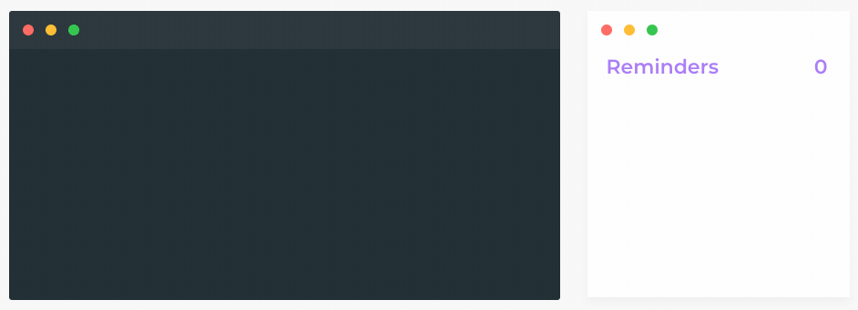

<div align="center">
  
	<p>
		<b>A minimalist CLI for the macOS Reminders app</b>
	</p>
</div>

<br>



```
$ rmind review PR tomorrow morning
```

- 🔥 Add reminders with natural language from the terminal
- ⭐️ Support for macOS Sierra, Mojave and Catalina
- 🎉 Optionally configure the default list for reminders
- 🌈 Register alias for Reminder Lists

## Installation

```
$ npm i -g rmind
```

## Usage

### Basic

Type `rmind` to add a reminder. Set remind dates using natural language.

```
$ rmind publish blog post this friday at 4pm
$ rmind clean up crontab in 1 month
$ rmind ask Leena for PR review in 40 mins
$ rmind call mom tonight
```

It will automatically open the Reminders App and add your reminder to the default list.

### Initial config

When you run `rmind` for the first time, you'll be asked to configure the list where the reminders will be put by default. You can change this anytime with `rmind --config`.

### Configuration

Enter configuration mode by typing:

```
$ rmind --config
```

In this mode, you'll be able to do any of the following actions:

- Configure default list for reminders
- Register a new list alias

#### List Alias

You can add reminders to different lists by configuring aliases.

1. Enter config mode `rmind --config`
2. Select option **Add a new list alias**
3. Select the list you want to configure
4. Type an alias. It's recommended to keep this to 1 or 2 characters.

For example, if you set an alias of `g` for your list Groceries, you'll be able to add items this way:

```
$ rmind -l g cereal milk
```

# Contributing

1. Fork the project
2. `rmind.ts` is the entry point to the CLI
3. Run `yarn link` so that `rmind` gets registered globally
3. To test your changes first run `npm run build` and then use `rmind` in the terminal

# License

MIT © [Carlos Roso](https://carlosroso.com/)

